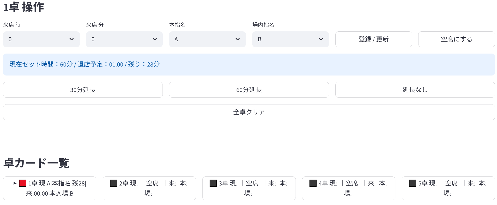

# 付け回しシステム MVP

## 概要

キャバクラ・ラウンジ等で使用される付け回し業務を簡易シミュレーションする Streamlit アプリです。

## 主な機能

- 20卓管理
- 本指名
- 場内指名
- ヘルプ
- 10分前戻し
- 延長処理
- 重複警告
- 手動実績登録
- リアルタイム再計算

## 使用技術

- Python
- Streamlit

## ファイル構成

- app.py  
  画面UI・操作処理

- logic.py  
  付け回しロジック

- settings.py  
  定数・設定

- state.py  
  セッション状態管理

- time_utils.py  
  時刻変換処理

- ui_helpers.py  
  UI表示補助

## 起動方法

```bash
pip install -r requirements.txt
streamlit run app.py
```

## 今後の予定

- 比例回し
- 優先度ロジック改善
- DB保存
- 複数端末同期
## アプリ画面


## 工夫した点

- logic.py に付け回しロジックを分離
- session_state を使用した状態管理
- 予定スケジュールと実績入力を分離
- 卓カードによるリアルタイム表示
- 本指名・場内指名・ヘルプ状態を色分け表示

## 学習・改善ポイント

開発中に以下の問題が発生し、修正を行いました。

- Streamlit rerun による無限再描画
- セッション状態更新時の表示崩れ
- 延長処理後のスケジュール再計算
- 卓カード表示と現在状態の同期

これらを通じて、

- 状態管理
- 再描画
- ロジック分離
- デバッグ

について理解を深めました。
